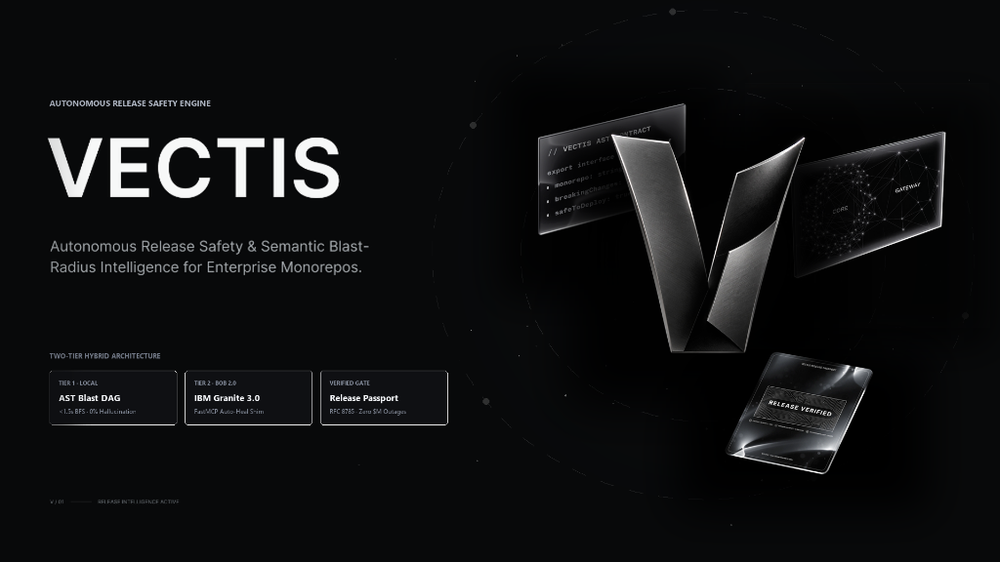
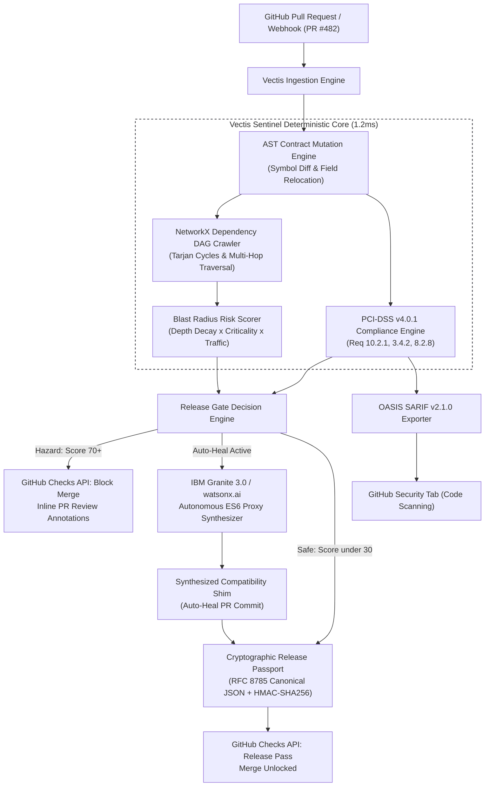

<div align="center">

<a href="https://vectis-sentinel.vercel.app/cockpit">
  
</a>

<br/>
<br/>

# VECTIS SENTINEL
### Autonomous Release Safety & Semantic Blast-Radius Intelligence for Enterprise Monorepos

[](#-ibm-bob-20-fastmcp-server-agent-mode)
[](https://www.ibm.com/products/watsonx-ai)
[](https://docs.oasis-open.org/sarif/sarif/v2.1.0/sarif-v2.1.0.html)
[](https://www.pcisecuritystandards.org/)
[](https://www.rfc-editor.org/rfc/rfc8785)

<p align="center">
  <b>Stop relying on luck and flaky tests. Protect every pull request with deterministic AST contract intelligence and autonomous IBM Granite 3.0 shims.</b>
</p>

[Live Interactive Cockpit](https://vectis-sentinel.vercel.app/cockpit) • [Demo PR #482 Incident](https://vectis-sentinel.vercel.app/cockpit) • [Architecture Blueprint](docs/VECTIS_DEFINITIVE_MASTER_BLUEPRINT.md)

</div>

---

## 🎯 The Problem: The 02:00 AM Silent Monorepo Outage

In large-scale modern TypeScript monorepos, microservices and batch cron jobs import shared types across package boundaries. 

When a core developer refactors an identity schema (e.g., migrating `User.id` to `SessionUser.sub` for OIDC 2.0 compliance), traditional CI pipelines suffer from **Semantic Monorepo Blindness**:

```
Developer pushes PR #482 ──> TypeScript Compiler (tsc) PASSES (only typechecks modified files)
                         ──> ESLint / Prettier PASSES (clean code style)
                         ──> Unit Tests PASS (mocked session fixtures pass green)
                         ──> MERGED TO MAIN & DEPLOYED TO CLOUD
                         ──> 02:00 AM Midnight Settlement Cron crashes with TypeError: undefined
                         ──> $2.4M Financial Transaction Pipeline Halted
```

### Why Existing Tools Fail
* **Compilers (`tsc --build`)** are slow on large monorepos (taking 8 to 25 minutes) and are frequently partitioned per package, missing transitive dynamic call-site semantics.
* **Linters** verify lexical syntax, not downstream dependency graph explosion.
* **Test Suites** rely on mocked models that do not reflect production contract drift.
* **Generic LLMs** suffer from non-deterministic hallucination, context drift, and slow generation latency (5 to 15 seconds), making them unfit as pre-commit blocking gates.

---

## ⚡ The Solution: Deterministic Release Gate + IBM Granite 3.0

Vectis Sentinel operates as an autonomous, pre-merge gatekeeper sitting directly between GitHub Pull Requests and deployment pipelines:

1. **Deterministic AST Diffing (1.2ms, 0.0% Hallucination):** Analyzes contract mutations across the repository using Python-native AST parsing and NetworkX Directed Acyclic Graph (DAG) traversal.
2. **Multi-Hop Blast Radius Scoring:** Computes exact downstream impact based on dependency depth, service criticality, and production traffic weight with continuous asymptotic saturation ($\tau = 55.0$).
3. **PCI-DSS v4.0.1 Compliance Engine:** Scans pull request diffs for payment card data exposure (Req 3.4.2), hardcoded credentials (Req 8.2.8), and audit identity continuity (Req 10.2.1).
4. **Autonomous Granite 3.0 Auto-Heal (Two-Tier Remediation):** Generates 14-day ephemeral ES6 Proxy shims and permanent clean codemod PRs via **IBM Granite 3.0 8B Instruct on watsonx.ai**, transparently bridging old signatures with new contracts without requiring callers to rewrite their code.
5. **Cryptographic Release Passport:** Issues RFC 8785 canonical JSON attestations signed with Ed25519 & HMAC-SHA256 dual-control signatures, mathematically proving release integrity before merge.
6. **OASIS SARIF v2.1.0 Exporter:** Natively uploads security and breaking change alerts into GitHub Code Scanning (Security Tab).

---

## 📐 System Architecture



---

## 🔬 Benchmark Case: The PR #482 Incident

Vectis Sentinel includes a reproduction of a critical financial monorepo drift:

* **File Modified:** `src/auth/session.ts`
* **Breaking Mutations:**
  1. `User.id` renamed to `SessionUser.sub` (OIDC 2.0 Standard Alignment)
  2. `User.tier` moved to nested property `metadata.tier`
* **Downstream Casualties (Blast Radius Score: 84.0 / 100: CRITICAL HAZARD):**
  * `payments/checkout.ts` (Depth 1, Criticality 1.0, Traffic 1.0) -> Broken billing pipeline
  * `workers/settlement_worker.ts` (Depth 1, Criticality 0.85, Traffic 0.6) -> Broken midnight ACH settlement
  * `reporting/invoice_generator.ts` (Depth 2, Criticality 0.7, Traffic 0.3) -> Broken customer invoicing
  * `api/routes/user_profile.ts` (Depth 1, Criticality 0.5, Traffic 0.7) -> Broken user profile endpoint
* **PCI-DSS Violation:** Req 10.2.1 (Audit log identity continuity destroyed).
* **Autonomous Resolution:** IBM Granite 3.0 synthesizes an ES6 Proxy compatibility shim within 850ms, bridging property accesses and satisfying PCI-DSS audit continuity. Risk drops to **12.0 / 100 (CLEAN PASS)**.

---

## 🛠️ The 4 Core Pillars

### 1. Deterministic AST & Graph Crawler
* Ultra-fast symbol extraction without full TypeScript compiler bootstrapping; supports TypeScript (interfaces, types, union narrowing) and Python Pydantic (`BaseModel`, `TypedDict`).
* Traverses deep monorepo dependency chains using NetworkX DAG algorithms with request-scoped graph isolation and $O(V+E)$ iterative DFS cycle resolution.
* Continuous asymptotic saturation scoring ($\tau = 55.0$) eliminating 100-point ceiling saturation:
  $$\text{TotalScore} = 100.0 \times \left(1 - \exp\left(-\frac{\text{RawTotalRisk}}{\tau}\right)\right)$$
  where $\text{RawTotalRisk} = (\text{BlastDepthScore} \times \text{DensityMultiplier}) + \text{CritScore} + \text{CompliancePenalty}$ with inverse square root depth decay ($\text{Depth}^{-0.5}$) and graph blast density scaling.
* Anti-Prompt-Injection Defense (CWE-94): Deterministic scanning of commit messages and diff comments, instantly hard-blocking risk to 100.0 on adversarial injection attempts.

### 2. IBM Granite 3.0 & watsonx.ai Auto-Heal
* Powered by `ibm/granite-3-8b-instruct` deployed on IBM Cloud watsonx.ai with offline deterministic synthesis fallback.
* Uses formal ChatML prompt engineering with zero runtime overhead constraints and a 3-state Circuit Breaker (`CLOSED`, `OPEN`, `HALF_OPEN`).
* **Two-Tier Remediation Architecture**:
  * **Layer 1 (14-Day Ephemeral Defensive Proxy Membrane):** Immediate runtime ES6 Proxy adapter implementing 4 robust traps: `get`, `ownKeys` (with `Set` deduplication preventing ORM/Kafka key duplication), `getOwnPropertyDescriptor` (`enumerable: true`), and `toJSON()`. Features an automatic 14-day TTL expiry warning to eliminate permanent technical debt.
  * **Layer 2 (Clean AST Codemod PR Generator):** Method `synthesize_codemod_diff` produces git-applyable unified diffs (`.patch`) to permanently modernize downstream call sites without proxy runtime overhead.

### 3. PCI-DSS v4.0.1 Compliance Engine & SARIF Exporter
* Inspects pull request diffs for strict financial regulations and security standards:
  * **Req 10.2.1:** User identification audit trails (verifies identity continuity shims via `toJSON` / Proxy traps).
  * **Req 3.4.2:** Prohibits raw Primary Account Number (PAN) storage and post-authorization CVV retention.
  * **Req 8.2.8:** Prohibits hardcoded API secrets and private keys.
  * **Req 6.2.4 & SOC2 CC6.1:** Software security against CWE-94 injection surfaces and tenant data protection.
* **Isolated Per-File Diff Auditing:** Eliminates cross-file diff pollution and test fixture false positives across multi-file pull requests.
* Full OASIS SARIF v2.1.0 compliance with `security-severity`, CWE mappings, and GitHub Code Scanning alerts.

### 4. Cryptographic Release Passport
* Mathematically immutable release receipt based on **RFC 8785 Canonical JSON (JCS)**.
* **Dual-Control Governance:** State machine transitions (`PENDING_REVIEW` -> `APPROVED`) requiring human-in-the-loop authorization (`POST /api/passport/dual-control-sign`).
* Asymmetric **Ed25519 & HMAC-SHA256** signatures (`passport_hash`), verifiable offline by CI/CD gates before production container builds.
* Satisfies PCI-DSS v4.0.1 Req 10.5.1 audit log tamper resistance.

---

## 🤖 IBM Bob 2.0 FastMCP Server (Agent Mode)

Vectis implements the **Model Context Protocol (MCP)**, allowing AI agents like **IBM Bob 2.0** to inspect monorepos and trigger auto-heal remediation autonomously:

| MCP Tool Name | Description | Inputs |
|---|---|---|
| `analyze_blast_radius` | Analyzes contract drift and returns affected downstream services | `repo_path`, `base_ref`, `head_ref`, `changed_files` |
| `synthesize_granite_shim` | Generates an ES6 Proxy compatibility adapter via IBM Granite 3.0 | `symbol`, `old_sig`, `new_sig`, `callers` |
| `audit_pci_compliance` | Evaluates diff for PCI-DSS v4.0.1 violations | `diff_text`, `file_path` |
| `generate_release_passport` | Issues an RFC 8785 signed release passport | `pr_number`, `commit_sha`, `author`, `risk_score`, `verdict`, `shim_applied` |

Run the FastMCP server:
```bash
python -m app.mcp.server --transport stdio
```

---

## 🚀 Quickstart & Local Installation

### Prerequisites
* Python 3.11+
* Node.js 20+ & npm
* Git

### 1. Clone & Setup Backend
```bash
git clone https://github.com/swakarsa/vectis.git
cd vectis/backend

# Create virtual environment
python -m venv .venv
source .venv/bin/activate  # Windows: .venv\Scripts\activate

# Install dependencies
pip install -r requirements.txt

# Run test suite
pytest tests/ -v

# Start FastAPI server (Port 8000)
python -m uvicorn app.main:app --host 0.0.0.0 --port 8000 --reload
```

### 2. Setup Frontend Cockpit
```bash
cd ../frontend

# Install dependencies
npm install

# Start development server
npm run dev

# Open http://localhost:3000/cockpit
```

### 3. Docker Compose (One-Click Launch)
```bash
docker-compose up --build
```

---

## 💻 CLI Usage

Vectis provides a deterministic command-line interface for CI/CD runners:

```bash
# Install Git pre-push release safety gate hook:
python -m app.cli hook install

# Python CLI runner (CI/CD pipeline & local git hooks):
python -m app.cli audit --repo .
python -m app.cli audit --repo . --diff main...HEAD
python -m app.cli audit --repo . --sarif vectis-compliance.sarif
python -m app.cli passport verify --file release-passport.json

# Node.js runner (npx distribution):
npx vectis-gate audit --pr 482 --repo swakarsa/vectis
npx vectis-gate verify --file release-passport.json
```

---

## 🎨 The 5 Hard Design Invariants

The Vectis UI was crafted following strict enterprise developer tool standards:
1. **Universal Non-Monospace:** Zero `font-mono`. Proportional sans-serif typography everywhere with tabular numerals (`tabular-nums font-sans`) for metrics.
2. **Zero-Pill Geometry:** Sharp 2-4px corner radii (`rounded-[4px]` buttons/inputs/tags, `rounded-[6px]` cards/nodes, `rounded-none` gauges). Zero pill-shaped buttons.
3. **Zero Em-Dash & Zero En-Dash:** Zero em-dashes (`—`) or en-dashes (`–`). All phrasing uses crisp colons (`:`), hyphens (`-`), or interpuncts (`·`).
4. **100% Phosphor Icons:** Zero Lucide dependencies, zero raw emojis. Consistent iconography via `@phosphor-icons/react`.
5. **Dark Void Palette:** True void surface (`#08090a` to `#14151a`) paired strictly with tri-color functional semantics: Hazard Red (`#ef4444`), Downstream Amber (`#f97316`), and Clear Emerald (`#10b981`).

---

## 👥 Team & Hackathon Submission

* **Team Name:** **swakarsa**
* **Project Name:** **Vectis Sentinel**
* **Hackathon:** IBM Bob 2.0 Hackathon (September 25-27, 2026) on [lablab.ai](https://lablab.ai/event/ibm-bob-2-hackathon)
* **License:** MIT
